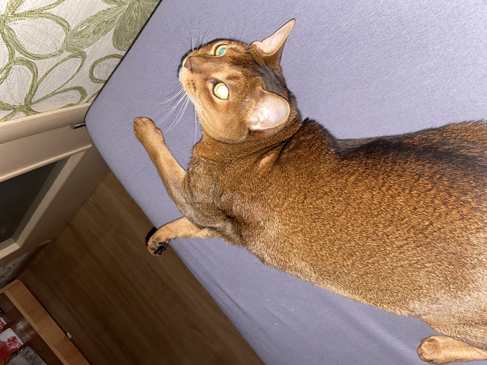

# Инструкция для работы с Markdown
## Выделение текста

Чтобы выделить текст курсивом надо обрамить его звездочками (*) или знаком нижнего подчеркивания. Например, *вот так* или _вот так._

Чтобы выделить текст полужирным надо обрамить его двумя звездочками (**) или двумя знаками нижнего подчеркивания. Например, **вот так** или __вот так.__

Альтернативные способы выделения текста жирным или курсивом нужны для того, чтобы мы могли совмещать оба этих способа.

Тест может быть выделен курсивом и при этом быть _**полужирным.**_ 
## Списки

Чтобы добавить ненумерованный списки, необходимо поставить звездочку и пробел, или знак +. например:
* Элемент 1
* Элемент 2
* Элемент 3
+ Элемент 4

Для того, чтобы добавить нумерованный списки, необходимо их просто пронумеровать. Например, вот так:

1.Элемент 1

2.Элемент 2

## Работа с изображениями

Чтобы вставить изображение, надо делать так:

## работа с изображениями
## Ссылки
## Работа с таблицами
## Цитаты
## Заключение
